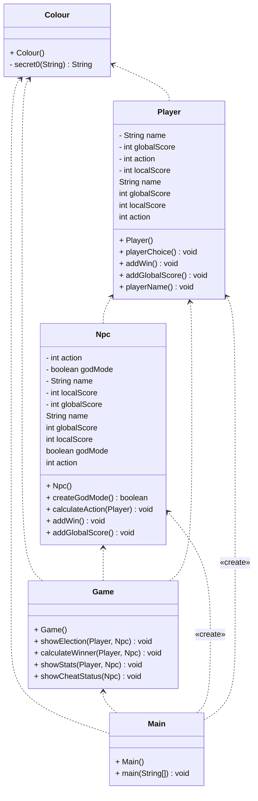

```mermaid
classDiagram
direction BT
class Colour {
  + Colour() 
  - secret0(String) String
}
class Game {
  + Game() 
  + showElection(Player, Npc) void
  + calculateWinner(Player, Npc) void
  + showStats(Player, Npc) void
  + showCheatStatus(Npc) void
}
class Main {
  + Main() 
  + main(String[]) void
}
class Npc {
  + Npc() 
  - int action
  - boolean godMode
  - String name
  - int localScore
  - int globalScore
  + createGodMode() boolean
  + calculateAction(Player) void
  + addWin() void
  + addGlobalScore() void
      String name
      int globalScore
      int localScore
      boolean godMode
      int action
      }
      class Player {
  + Player() 
  - String name
  - int globalScore
  - int action
  - int localScore
  + playerChoice() void
  + addWin() void
  + addGlobalScore() void
  + playerName() void
      String name
      int globalScore
      int localScore
      int action
      }

Game  ..>  Colour 
Game  ..>  Npc 
Game  ..>  Player 
Main  ..>  Colour 
Main  ..>  Game 
Main  ..>  Npc : «create»
Main  ..>  Player : «create»
Npc  ..>  Player 
Player  ..>  Colour 
```